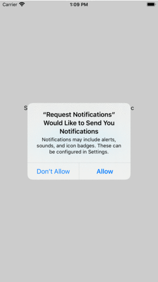

Test project to setup local scheduled notification.
By pressing the button, notification scheduled to appear in 5 sec

### Usage:
* `UserNotifications`
* `Request Notification Authorization`
* `Layout Constraints`
* `Timer`
 
### Features: 
* support all iPhone models
* contains picture in notification
* schedule, snooze, delete options
